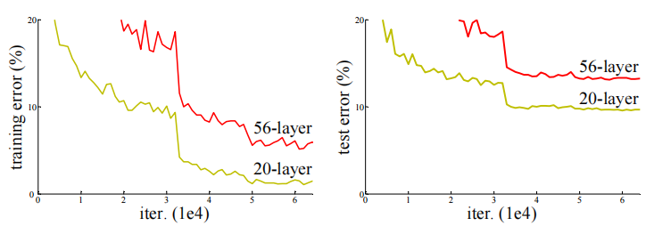
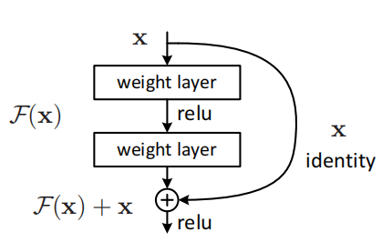
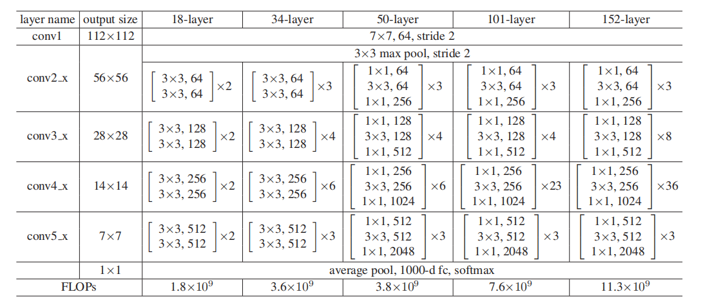
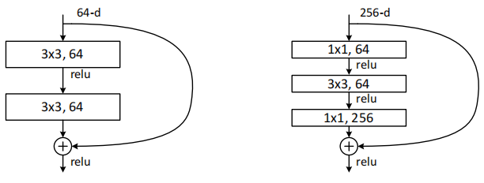
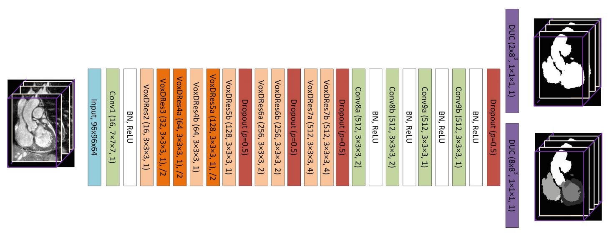

## ResNet

This part will be update.

 _Is learning better networks as easy as stacking more layers?_

 _学习更好的网络是否像堆叠更多的层一样容易？_

这是在论文[1]中提出的问题，回答这一问题的一大障碍就是梯度消失\/爆炸问题，这一问题阻碍了收敛。这个问题在ResNet提出之前通过归一化初始化和中间归一化层来得到很大程度的解决，使具有数十层的网络收敛。但是更深的网络会出现退化的问题，而这种问题并非是由于过拟合引起的。

ResNet引入一个深度残差学习的框架来解决退化问题，通过显式的让堆叠的层适合残差映射。

将期望的映射表示为)，更浅层的网络连过来的线表示为，前一层传递的为)，因此，+x)

这样即使在极端的情况下=0)时，也可以保证)至少等于。

残差网络层数不同时，网络结构也有一定的变化

两种不同的残差单元

## Dilated Residual Network (DRN)

This part will be update, too.

## Voxelwise Dilated Residual Network (VoxDRN)

This part will also be update.

## Bayesian CNN [4-1]

这篇论文将网络中的dropout和贝叶斯网络中的变分推理结合起来。

### 概率建模和变分推理

给定训练输入和对应的输出。在概率建模中，希望估计一个函数：)。

按照贝叶斯方法，在函数空间)给出先验分布，定义一个概率)来表示给定函数生成观测的过程。在给定数据集的函数空间上寻找后验分布)。通过对所有可能的函数积分，来预测一个新的输入的输出。

通过变分推导，将上述公式推导得到，即

### dropout

这里定义

## Bayesian VoxDRN [4-0]

### 网络结构

Gal 和 Ghahramani [4-1] 中证明，贝叶斯CNN在小数据的过拟合上提供了更好的鲁棒性。这一网络是目的是找到后验概率 ) 在网络中用variational dropout来解决这一问题。

Bayesian VoxDRN基于这种思想设计，在上面的VoxDRN的基础上加入了4个额外的dropout层。并且最后的输出变成了两个DUC层输出两类结果，这两类输出会在下文训练中提到。

这其中的dropout层训练时的丢弃概率为0.5，以此避免过拟合。

利用dropout对权重的后验概率进行抽样，得到softmax类概率的后验分布。最终分割结果由这些样本进行多数投票获得。在这篇论文的全心分割中，使用10个样本来进行多数投票以得到更好的准确性和处理效率的权衡。

### 损失函数

这篇论文中提到的损失函数结合了加权聚焦损失 (weighted focal loss) 和Dice损失 (Dice loss) ，论文希望以此来解决分类不均衡的问题。

其中，加权聚焦损失：

^\lambda log\left ( p_c \right ))

其中 和  分别表示所有类的频率和 _c_ 类的频率，因此用来自适应地平衡心脏子结构大小的重要性。

表示 _c_ 类的概率，^\lambda) 是一个尺度因子(scaling factor)，用来减少好的分类样本的相对损失。通过这样来更关注难分类和错分类的样本。

Dice损失：

其中表示 _X_ 和 _Y_ 的交集， 和  分别表示 _X_ 和 _Y_ 的元素个数。就语义分割问题而言， _X_ 表示金标准，_Y_ 表示分割图像。

两个损失函数更具体的内容参看
- [加权聚焦损失](../Loss_function/focal_loss)
- [Dice损失](../Loss_function/dice_loss)

这篇论文中，将聚焦损失和Dice损失结合，由于聚焦损失会导致网络保留复杂的边界细节，但会带来噪声，Dice损失会产生更平滑的分割。

### 迭代开关训练(Iterative Switch Training)

这篇论文使用一种渐进学习策略(progressive learning strategy)来对所提出的Bayesian VoxDRN网络进行训练。

这种策略的主要目的与其他的深度学习的全心分割的思想类似，即，将前景和背景分开，再将前景继续分割成心脏的不同子结构。网络被训练成每一步都解决比原来更简单的问题。网络的最后一层改为两个分支，一个分支由二值化标签估计前景背景，一个分支由多分类标签估计心脏多个子结构。在训练时，每次只训练一个分支。具体而言，在每个训练阶段，首先训练二进制分支，将前景背景分开，然后训练多分类分支，将心脏子结构分开。在测试时，只对多分类感兴趣。

[1] He K, Zhang X, Ren S, et al. Deep residual learning for image recognition[C]//Proceedings of the IEEE conference on computer vision and pattern recognition. 2016: 770-778.

[4-0] Shi Z, Zeng G, Zhang L, et al. Bayesian voxdrn: A probabilistic deep voxelwise dilated residual network for whole heart segmentation from 3d mr images[C]//International Conference on Medical Image Computing and Computer-Assisted Intervention. Springer, Cham, 2018: 569-577.

[4-1] Gal Y, Ghahramani Z. Bayesian convolutional neural networks with Bernoulli approximate variational inference[J]. arXiv preprint arXiv:1506.02158, 2015.
