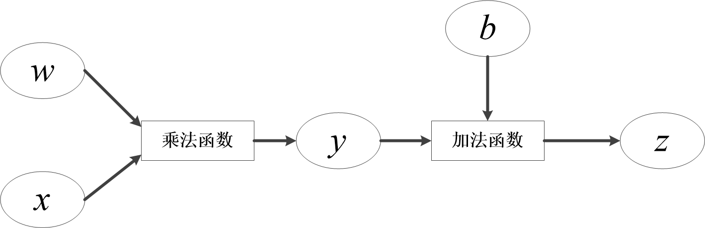

PyTorch提供了autograd来自动求导，将前向传播的计算记录成计算图，自动完成求导。

## Tensor的自动求导：Autograd

自动求导机制记录了Tensor的操作，以便自动求导和反向传播。

```python
import torch
a = torch.randn(2, 2, requires_grad=True)
```

这里的requires_grad参数表示是否需要对该Tensor进行求导，默认为False；设置为True则需要求导，并且依赖于该Tensor的之后的所有节点都需要求导。

Tensor有两个重要属性，分别记录Tensor的梯度和经历的操作。
- grad: 该Tensor对应的梯度，类型为`Tensor`，与Tensor同维度
- grad_fn: 指向`function`对象，即该Tensor经过了什么样的操作，用作反向传播的梯度计算，如果该Tensor由用户自己创建，则该grad_fn为None。

## 计算图

计算图是PyTorch对于神经网络的具体实现形式，包括每一个数据Tensor及Tensor之间的函数function。以为例，通常在神经网络中，为输入，与为网络需要学习的参数，为输出，计算图构建方法如图：

